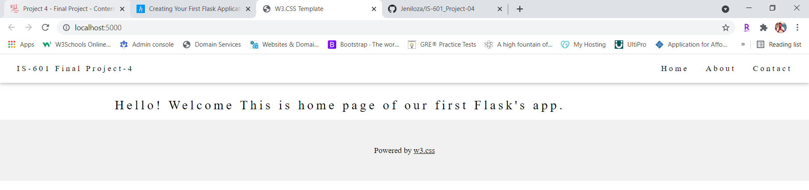
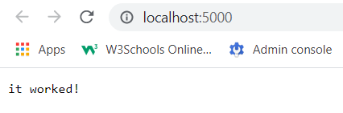
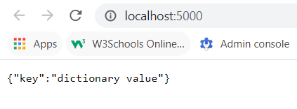
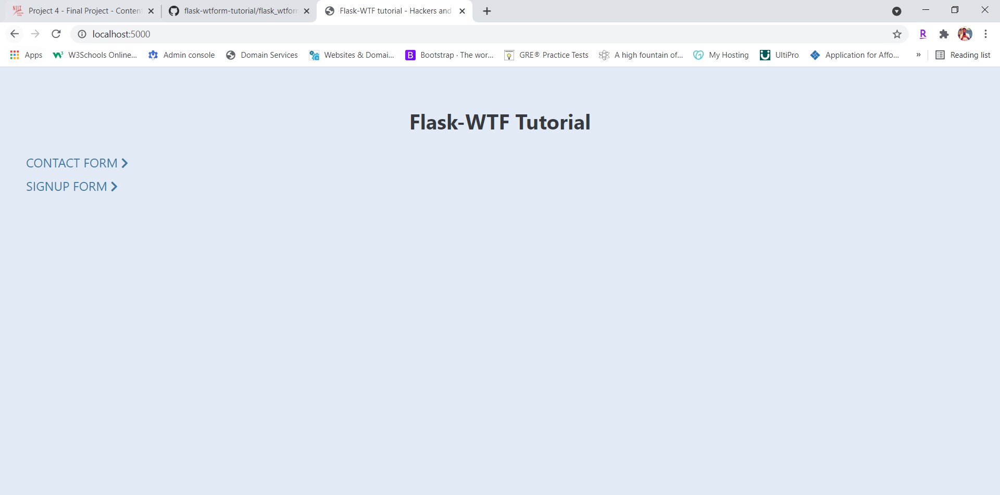
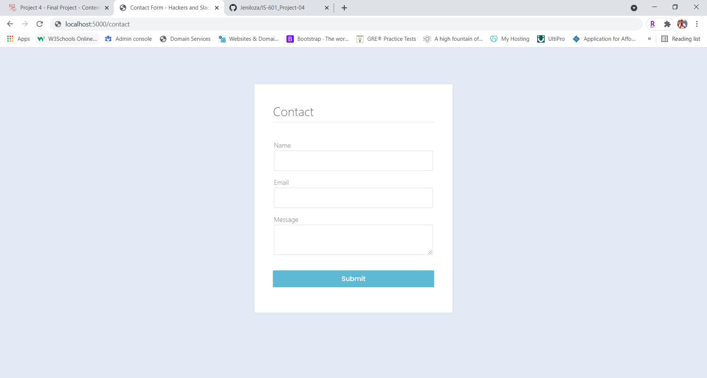
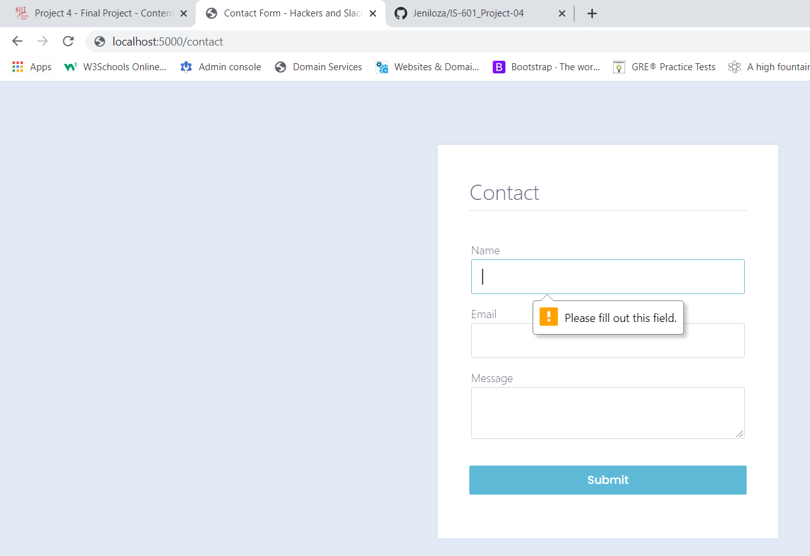
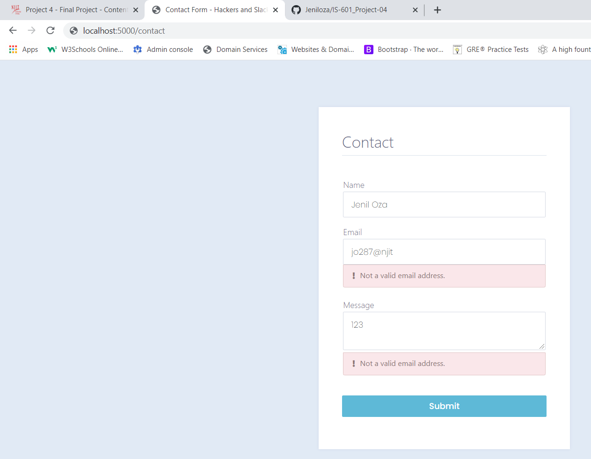

# Web App with Python Flask!

## Why Flask?

## Tutorial-1 : Creating Your First Flask Application

### Output of Initial Commit : Print "Hello World!":

### Output of Commit : A Basic Flask Route square_of_number_plus_nine method imported from logic.py file.!

### Output of Commit : Other Parts of Flask's Core Library and Serving Raw HTML.!

### Output of Commit : Other Parts of Flask's Core Library and Serving an HTML Page Template.!

### Output of Commit: Serving a Response as specify whether the route at hand is a POST, GET, or some other method.
 

### Output of Commit: Create JSON responses, check out Flask's built-in jsonify() function. 
jsonify() outputs a Python dict as JSON inline.
 

## Tutorial-2 : Rendering Pages in Flask Using Jinja

### Output of Commit: Rendering Pages in Flask Using Jinja.
 

## Tutorial-3 : Handling Forms in Flask with Flask-WTF
 
 
 
 