# Web App with Python Flask!

## Why Flask?
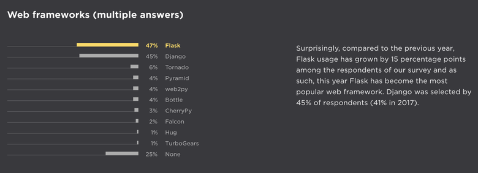

## Tutorial-1 : Creating Your First Flask Application.
 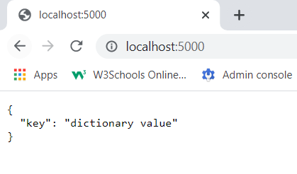
 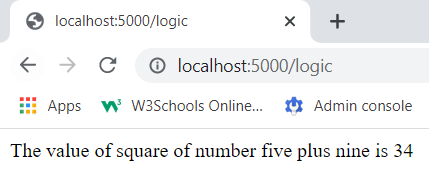
 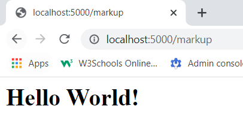
 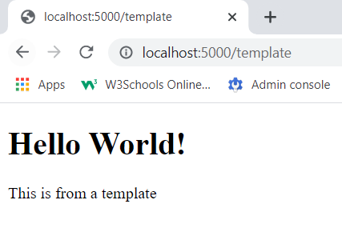
 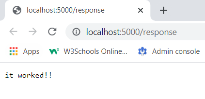
 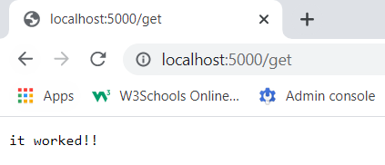

## Tutorial-2 : Rendering Pages in Flask Using Jinja.
 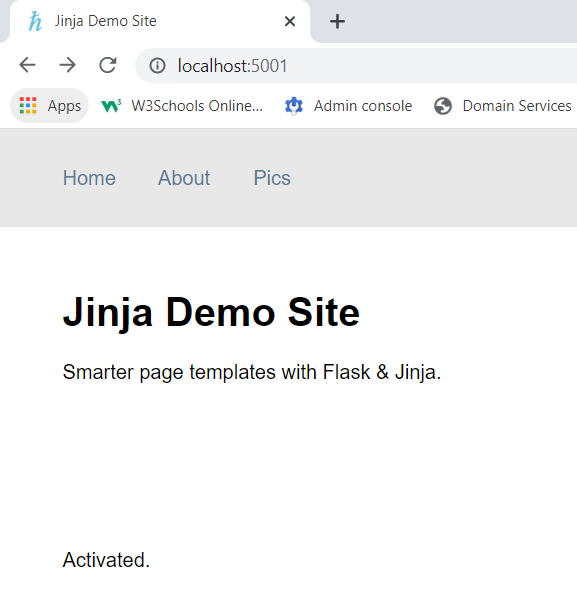

## Tutorial-3 : Handling Forms in Flask with Flask-WTF.
 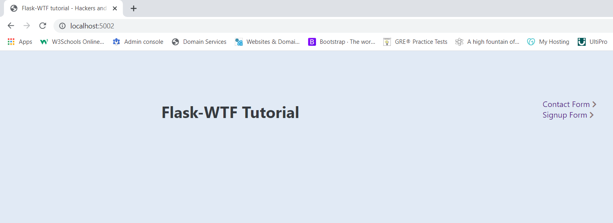
 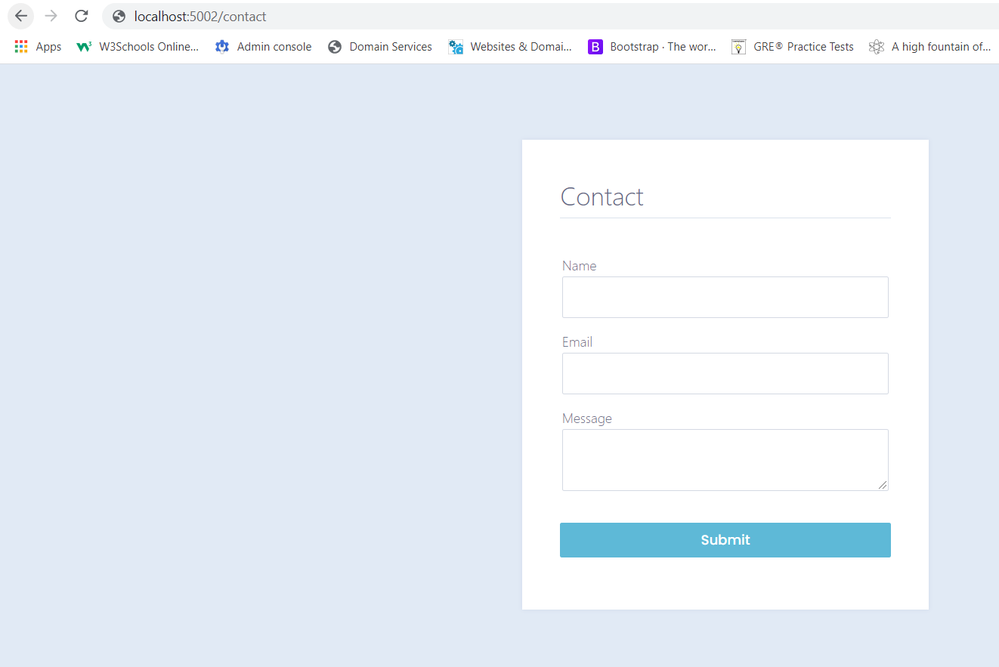
 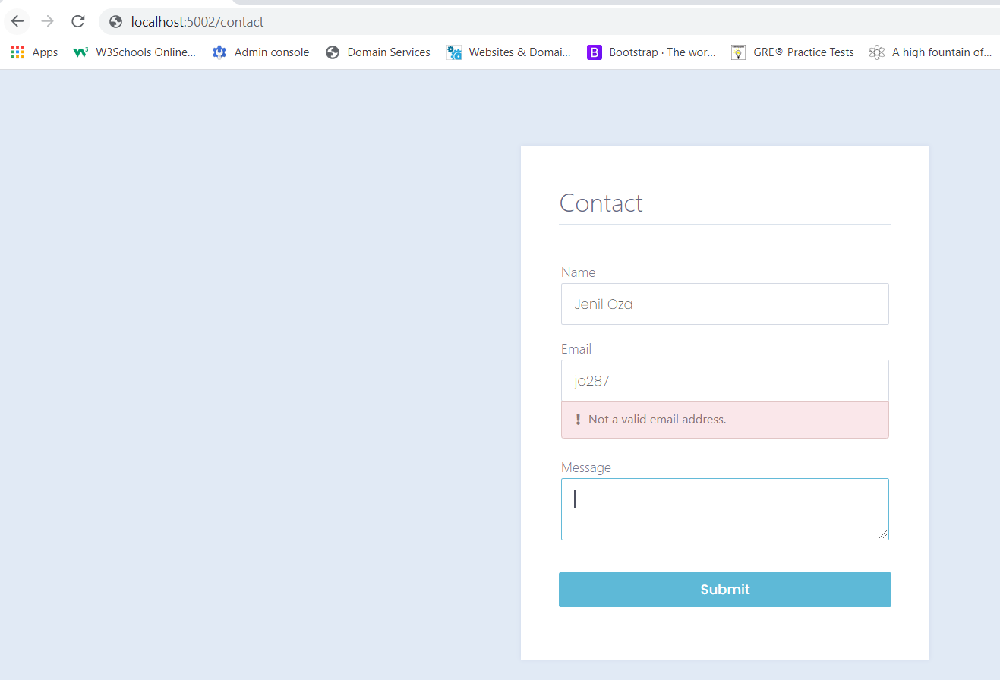
 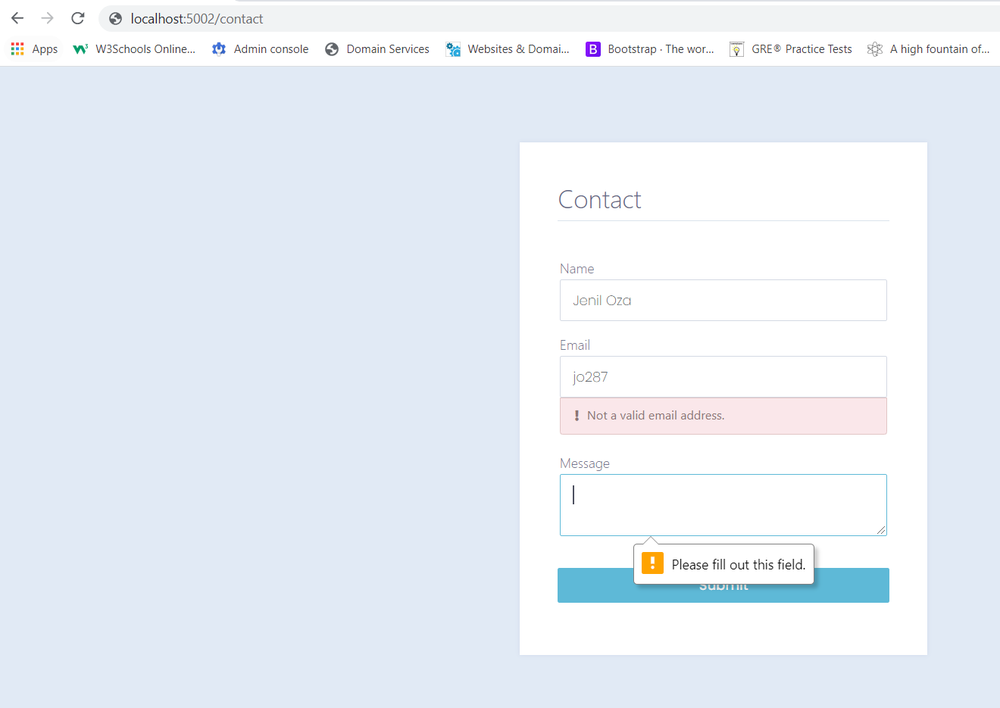
 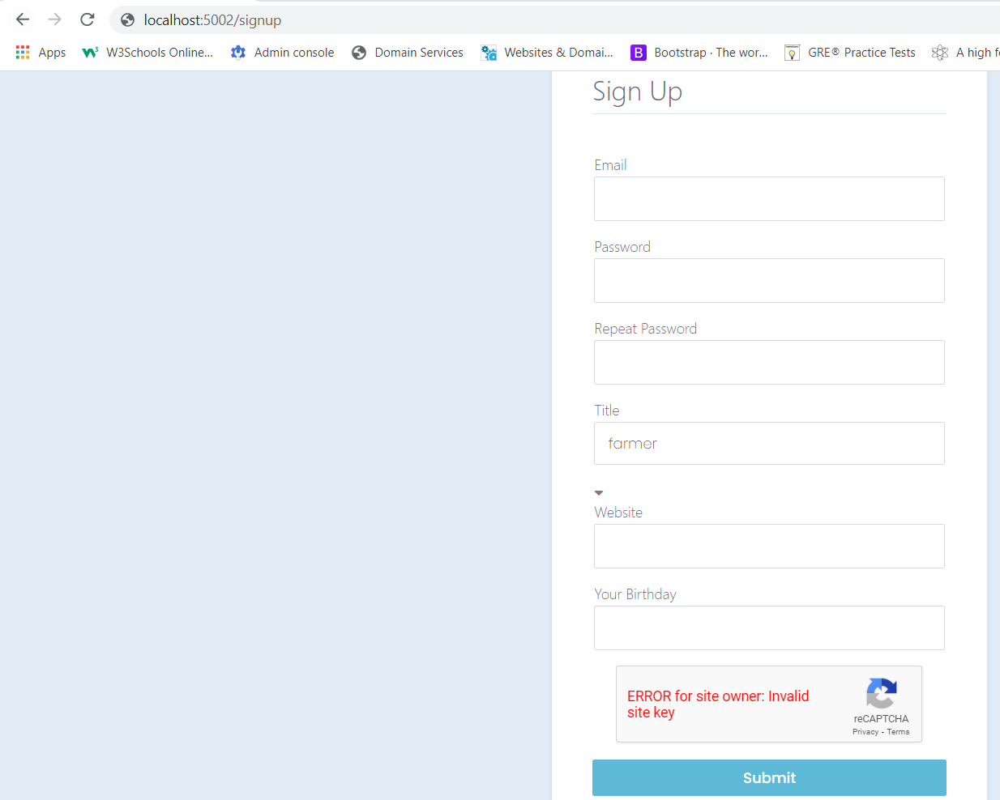
 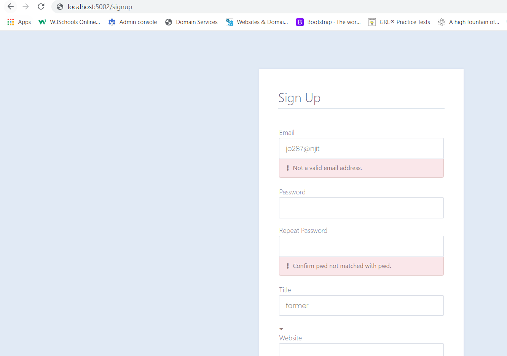

## Tutorial-4 The Art of Routing in Flask. 
 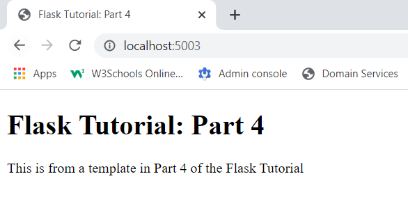

## Tutorial-5 Configuring Your Flask App.
 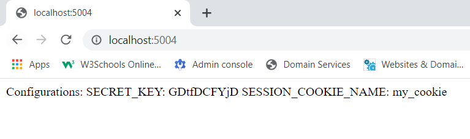

## Tutorial-6 Demystifying Flask’s Application Factory.

## Tutorial-7 Organizing Flask Apps with Blueprints
 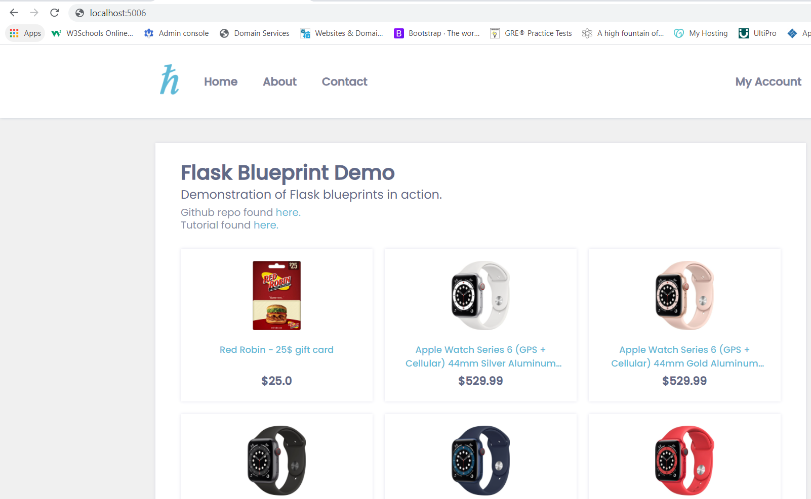
